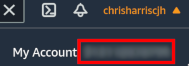
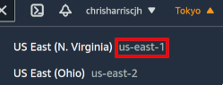
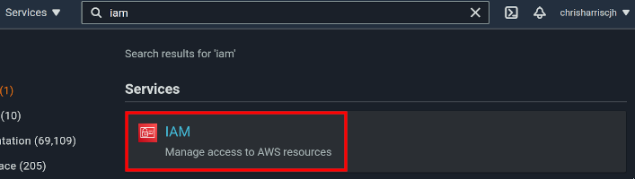
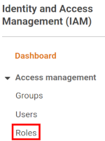
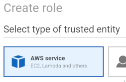
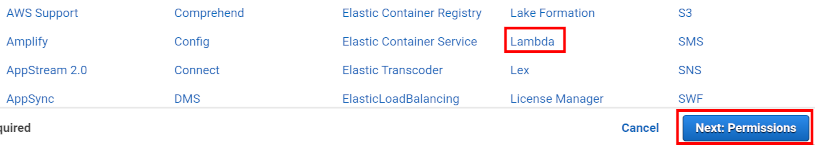
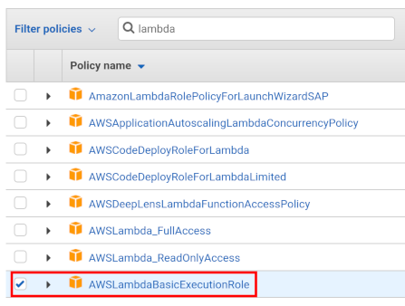

## Julia AWS Lambda Image
AWS does not provide native support for Julia, so functions must be put into containers which implement AWS's [Lambda API](https://docs.aws.amazon.com/lambda/latest/dg/runtimes-api.html), and uploaded to AWS ECR. This repo aims to reduce this to a simple process:
1. [Enter your configuration](#configjson) for your AWS account and the function to be created in the `config.json` file
2. [Add your function code](#adding-function-code) to the `react_to_invocation` function in `function/function.jl`
3. [Build the image](#build-the-image) locally, using the `build.jl` script: `julia build.jl buildimage`.
This will build your docker container. It also adds [two directories](#where-do-the-scripts-and-image-directories-come-from): `image` (containing the Dockerfile, and [the files that will be added to the Docker image](#the-image-directory), and `scripts`, containing [bash scripts that will be usful for managing the image](#the-scripts-directory). Amongst these are scripts to:
4. (Optionally) [test the container locally](#testing-the-container-locally) with a sample JSON, eg `bash scripts/test_image_locally.sh '{"Key1":"Value1"}'`
5. [Define the function on AWS Lambda](#defining-the-aws-lambda-function) - `bash scripts/login_to_aws.sh`, if you are not currently logged in, then `bash scripts/push_image_to_ecr_and_create_lambda_function.sh` to push the docker image to Amazon ECR and create the associated function in AWS Lambda.

### config.json
This is the config file for the Lambda image. It is divided into three parts (aws, image, and lambda_function, for your aws details, the docker image definition, and the AWS Lambda function respectively. The fields are as follows:
**aws**
- `account_id` is your 12-digit AWS ID. [See below for how to find this](#finding-your-user-details).
- `region` is your AWS region code. [See below for how to find this](#finding-your-user-details).
- `role` is the AWS role that will execute the lambda function. You will need to create this if you do not already have one. [Instructions to do so below](#creating-a-lambda-user-role).
**image**
- `name` is your chosen name for your Julia image. It will have the AWS Account ID, the region and other data prepended to it when built. The name has no functional effect.
- `tag` is the tag for your image. If you are not using version numbers, just use `latest`.
- `base` is the name of the Julia base image, by default `1.6.0`. A full list can be found at [docker hub](https://hub.docker.com/_/julia)
- `dependencies` is a list of Julia packages to add to the image. This should just be a list of strings that will be used with Pkg.add() - for example, `["DataFrames"]` for DataFrames.jl, or `["DataFrames", "Distributions"]`. These will be added to the image during the image build and precompiled.
- `runtime_path` is the path that will be created on the docker image to store the files used at runtime, including the julia file containing your function.
- `julia_depot_path` is the path that will be created on the docker image to act as the Julia depot path.
**lambda_function**
- `name` is the name for your lambda function. The function will be re-built each time the `push_image_to_ecr_and_create_lambda_function.sh` script is run. Note that this begins by **erasing any existing functions in AWS Lambda with the same name**.
- `timeout` is the period that Lambda will wait for the container to respond before timing out. Lambda's default value (3 seconds) is too small for a cold-started Julia container that has not been pre-packaged. 20 seconds should be sufficient.
- `memory_size` is the allocated memory to run the container with. Since Lambda charges per GB-second, you want this to relatively low. If it is set too low, Julia will throw a Segmentation Fault.

### Adding Function Code
The AWS Lambda API permits the container to return two values from a function call - a response, or an error. These are both JSONs, of no defined format. 

The only place you will need to add your function code is in the `react_to_invocation` function, in `function/function.jl`. This function can return either an `InvocationResponse` (a return value), or an `InvocationError` (an error value). The `InvocationResponse` struct has a single attribute, `response::String`, to which the responding function should pass a JSON-compatible string. The remaining code (in `template/image/_runtime/runtime.jl`) will handle the return value appropriately, depending on whether it is a response or an error. The `Invocation` object contains the full details for the invocation, but it is likely that you will only be interested in the `Invocation.body` attribute, which contains a JSON of the original function argument.

Note that AWS does not specify the format of its errors, and the fields of `InvocationError` that has been pre-defined in `function/function.jl` are arbitrary and may be changed without issue.

The example code currently in the `react_to_invocation` function does the following:
- Looks at the body (the original argument) of the invocation.
- Assumes that the body is a `Dict` and tries to get the value for the `"3 * 3?"` key. 
- If the key exists, and the value for the key is 9, it returns a single-word response - `"Indeed."`.
- If the key exists, but has any other value <value>, it returns `"3 * 3 != <value>"`.
- If the key does not exist at all, an `InvocationError` is returned.

### Testing the container locally
AWS provides an RIE (Runtime Interface Emulator) to allow you to test Lambda images locally before pushing them to AWS. This runs the container in a proxy of the environment that will be used on AWS servers. By running the `run_image_locally.sh` script, the container will be started locally (on port 9000). It will run non-detached, so to test it, open up another terminal window, then run the `test_image_locally.sh` script. You should see "SUCCESS" returned as a value, and be able to see debug information on the original terminal window.

### Defining the AWS Lambda function
When ready, run `bash ./push_image_and_create_function.sh` to run a script that will push the image to AWS Elastic Container Registry, and then create a Lambda function based on that image. You can log into AWS and go to the Lambda console to observe the function and test it.

### Building the files, or building the files and the image
The `build.jl` script comes with multiple commands, amongst which are `buildfilesonly` and `buildimage`. These two offer different routes for building the docker image:
- `buildimage` builds the docker image in full for you
- `buildfilesonly` adds the files to be added to the image, and a Dockerfile, to the `image` folder, but does not build the image. This allows you to edit any of these files prior to building. When ready to build, run `bash ./image/build_image.sh` to invoke the `image/build_image.sh` script, which will build the image locally. If you edit any files in the `image` directory, note that running either `build.jl buildimage` or `build.jl buildfilesonly` [will overwrite your changes](#where-do-the-scripts-and-image-directories-come-from) from the `template` folder. If you would like to make persistent changes to any of these files, you should edit the `template` folder.
After going through either of these processes, you should see the image in the output of `docker image ls`. The image name will contain your AWS Account number as well as the image name and tag defined in `config.json`.

### The `image` directory
The `./image` directory contains two things: 
- the Dockerfile for the image, and a `build_image.sh` script to create the image using the Dockerfile. The Dockerfile is created entirely programmatically and does not exist in the [template folder](#where-do-the-scripts-and-image-directories-come-from).
- a representation of the directory structure that will be added to the docker image. This includes, at minimum, the directory for the function runtime files, and the directory for the julia depot files. By default, these will be `image/var/runtime` and `image/var/julia` respectively. This representation is taken from the `template/image` directory.

### The `scripts` directory
The `./scripts` folder is created the first time you run a build, and contains bash scripts that are useful for working with the build. Their names are fairly self-explanatory.

### Where do the `scripts` and `image` directories come from?
The `template` folder contains templates for both the `scripts` and `image` folder that are generated in the project root folder. Each time the `build.jl` script is invoked with a `build...` command like `buildimage` or `buildfilesonly`, the following process takes place:
- the existing `scripts` and `image` in the root folder are deleted.
- they are then replaced by their versions in the `template` folder.
- all script files in the `template` folder (identified by their shebang) have their placeholders for configuration variables replaced - for example, the `run_image_locally.sh` script looks like this in the `template/scripts` folder:
```
docker run \
  -p 9000:8080 \
  -it $(image.full_image_string)
```
After it is copied to `./scripts`, `$(image.full_image_string)` is replaced with the full image name, so that it becomes, say, 
```
docker run \
  -p 9000:8080 \
  -it 111111111111.dkr.ecr.ap-northeast-1.amazonaws.com/julia-lambda:latest
```
- any special folder names in the newly-created `image` directory, like _runtime or _depot, are changed to the their appropriate values from the `config.json`.
- finally, the lambda function itself is copied to the runtime folder - defined in `config.json` but by default `./image/var/runtime`, from `./function`.

If you would like to make persistent changes to the scripts, or the files that are ultimately included in the docker image, you should make them in the `template` folder, in which case they will be included in future builds created from this folder.

### AWS-Craft
#### Finding your user details
Your account ID and your region can be found on the AWS navigation bar at the top of the screen:

After logging in to AWS, your user ID can be found by clicking on your username:

And your region code is listed next to the region name:


#### Creating a Lambda user role
From the navigation bar, go to the IAM console:


Select Roles:

 

and then click 'Create role'.

From within the new screen, select 'AWS service' 



then select 'Lambda' from the available options. Select 'Next: Permissions':



Filter for the 'AWSLambdaBasicExecutionRole' policy, and tick it before clicking 'Next: Tags':



Click through the 'Tags' screen, to the 'Review' screen. Enter a role name and then create the role:


### Troubleshooting
- **Segmentation Fault**: if the allocated memory for the Lambda function (defined in the `MemorySize` field of the `config.json`) is too low, Julia will not fail gracefully and will throw a Segmentation Fault. The default Lambda memory size (100mb) will cause this to occur.

Any problems, please log them as an issue on github!
