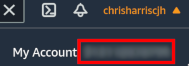
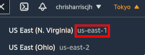
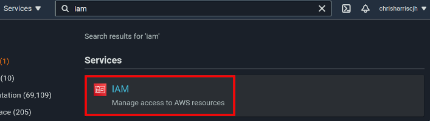
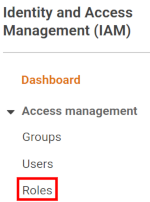
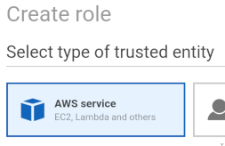
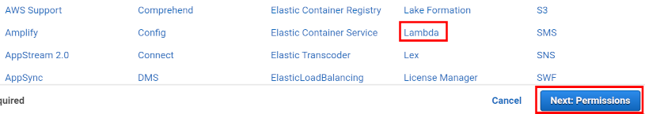
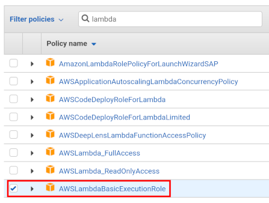
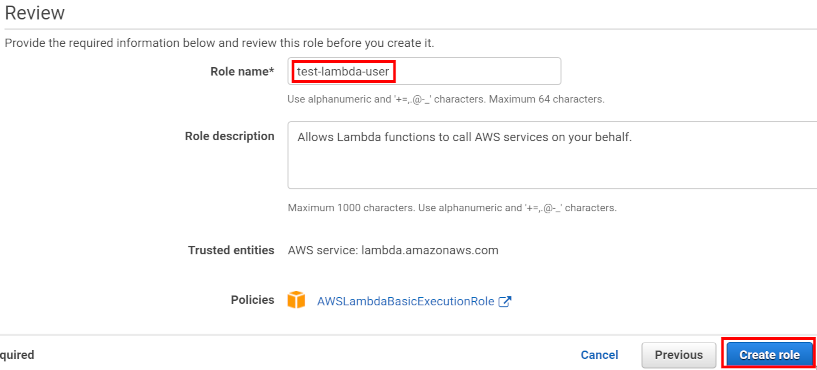

## Julia AWS Lambda Image
AWS does not provide native support for Julia, so functions must be put into containers which implement AWS's [Lambda API](https://docs.aws.amazon.com/lambda/latest/dg/runtimes-api.html), and uploaded to AWS ECR. This repo aims to reduce this to a simple process:
1. [Enter your AWS details](#configjson) (and some parameters for the Lambda function) in the `config.json` file
2. [Add your function code](#adding-function-code) to the `react_to_invocation` function in `julia-function-runtime/runtime.jl`
3. [Build the image](#build-the-image) locally.
Your container is then ready for testing and deployment. The provided bash scripts enable you to
4. (Optionally) [test the container locally](#testing-the-container-locally) before pushing to AWS, then
5. [Defining the function on AWS Lambda](#defining-the-aws-lambda-function) - push the container to AWS ECR, and create a lambda function which uses it.

### config.json
This is the config file for the Lambda image. The fields are as follows:
- `AWSAccountId` is your 12-digit AWS ID. [See below for how to find this](#finding-your-user-details).
- `AWSRegion` is your AWS region code. [See below for how to find this](#finding-your-user-details).
- `ImageName` is your chosen name for your Julia image. It will have the AWS Account ID, the region and other data prepended to it when built.
- `ImageTag` is the tag for your image. If you are not using version numbers, just use `latest`.
- `FunctionName` is the name for your lambda function. The function will be re-built each time the `push_image_and_create_function.sh` script is run, and that this begins by **erasing any existing functions in AWS Lambda with the same name**.
- `Role` is the AWS role that will execute the lambda function. You will need to create this if you do not already have one. [Instructions to do so below](#creating-a-lambda-user-role).
- `Timeout` is the period that Lambda will wait for the container to respond before timing out. The default value here (3 seconds) is too small for a cold-started Julia container. 20 seconds should be sufficient.
- `MemorySize` is the allocated memory to run the container with. Since Lambda charges per GB-second, you want this to relatively low. If it is set too low, Julia will throw a Segmentation Fault.
- `Dependencies` is a list of Julia packages to add to the image. This should just be a list of strings that will be used with Pkg.add() - for example, `["DataFrames"]` for DataFrames.jl, or `["DataFrames", "Distributions"]`. These will be added to the image during the image build and precompiled.

### Adding Function Code
The AWS Lambda API permits the container to return two values from a function call - a response, or an error. These are both JSONs, of no defined format. 

The only place you will need to add your function code is in the `react_to_invocation` function, `in julia-function-runtime/runtime.jl`. This function can return either an `InvocationResponse` (a return value), or an `InvocationError` (an error value). The `InvocationResponse` struct has a single attribute, `response::String`, to which the responding function should pass a JSON-compatible string. The code in `main()` will handle the return value appropriately, depending on whether it is a response or an error. The `Invocation` object contains the full details for the invocation, but it is likely that you will only be interested in the `Invocation.body` attribute, which contains a JSON of the original function argument.

The example code currently in the `react_to_invocation` function does the following:
- Looks at the body (the original argument) of the invocation.
- Treats the body as a JSON and tries to get the value for the `"What should I return?"` key. 
- If the key exists, and the value for the key is "Success", it returns a single-word response - `"SUCCESS"`.
- If the key exists, but has any other value <value>, it returns `"<value> was not a success"`.
- If the key does not exist at all, an `InvocationError` is returned.

### Build the image
Run `bash ./build_image.sh` to run the build image script. This will build the image locally, without pushing it to AWS. When it has completed, you should be able to see the image in the output of `docker image ls`. It will contain your AWS Account number as well as the image name and tag.

### Testing the container locally
AWS provides an RIE (Runtime Interface Emulator) to allow you to test Lambda images locally before pushing them to AWS. This runs the container in a proxy of the environment that will be used on AWS servers. By running the `run_image_locally.sh` script, the container will be started locally (on port 9000). It will run non-detached, so to test it, open up another terminal window, then run the `test_image_locally.sh` script. You should see "SUCCESS" returned as a value, and be able to see debug information on the original terminal window.

### Defining the AWS Lambda function
When ready, run `bash ./push_image_and_create_function.sh` to run a script that will push the image to AWS Elastic Container Registry, and then create a Lambda function based on that image. You can log into AWS and go to the Lambda console to observe the function and test it.

### AWS-Craft
#### Finding your user details
Your account ID and your region can be found on the AWS navigation bar at the top of the screen:

After logging in to AWS, your user ID can be found by clicking on your username:

And your region code is listed next to the region name:

#### Creating a Lambda user role
From the navigation bar, go to the IAM console:

Select Roles:

 

and then click 'Create role'.

From within the new screen, select 'AWS service' 

then select 'Lambda' from the available options. Select 'Next: Permissions':

Filter for the 'AWSLambdaBasicExecutionRole' policy, and tick it before clicking 'Next: Tags':

Click through the 'Tags' screen, to the 'Review' screen. Enter a role name and then create the role:

### Troubleshooting
- **Segmentation Fault**: if the allocated memory for the Lambda function (defined in the `MemorySize` field of the `config.json`) is too low, Julia will not fail gracefully and will throw a Segmentation Fault. The default Lambda memory size (100mb) will cause this to occur.

Any problems, please log them as an issue on github!
